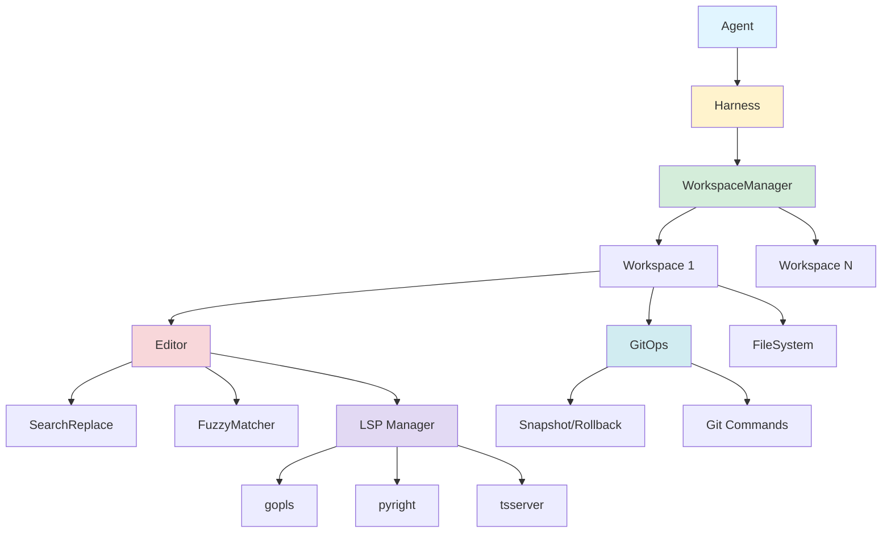
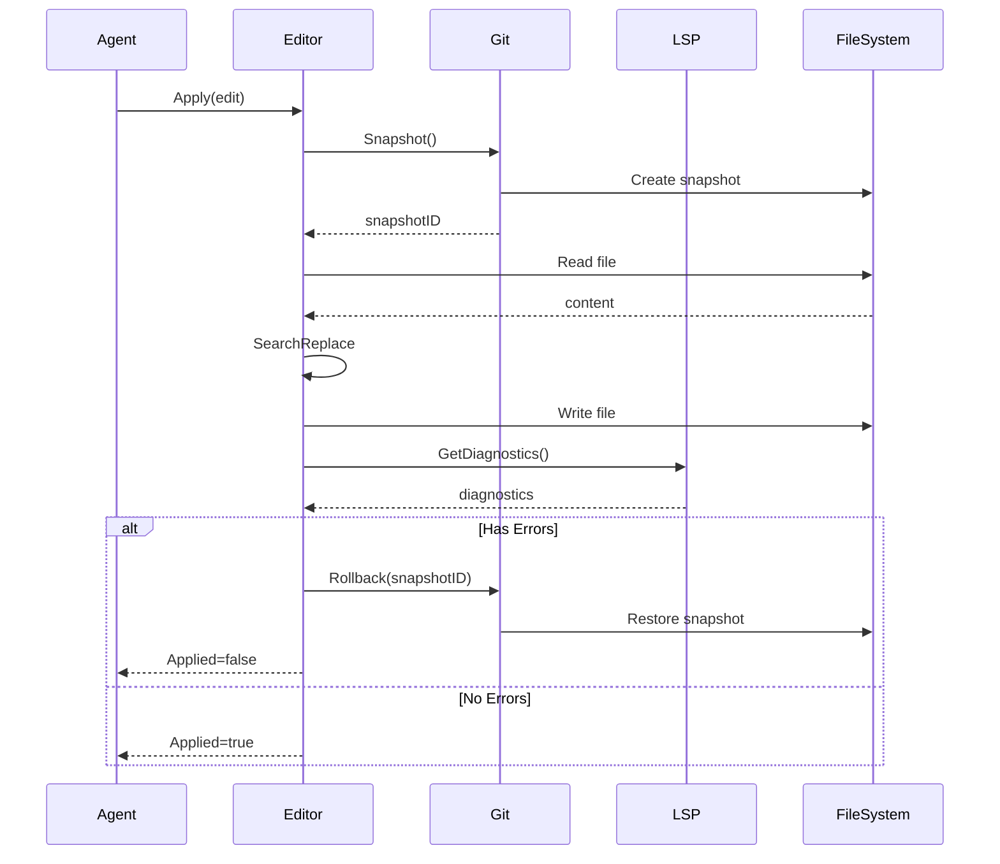

# CodeGen SDK

The CodeGen SDK provides intelligent code generation and modification capabilities for Gibson agents. It enables agents to clone Git repositories, apply code changes with LSP validation, and commit changes with proper attribution.

## Overview

The CodeGen SDK consists of four main packages:

- **workspace**: Repository cloning and workspace management
- **editor**: SEARCH/REPLACE code editing with fuzzy matching
- **git**: Git operations (branch, commit, push, snapshot/rollback)
- **lsp**: Language Server Protocol integration for validation

## Features

- **Line-Free Editing**: SEARCH/REPLACE approach without line numbers
- **Fuzzy Matching**: Tolerates whitespace and minor code differences
- **LSP Validation**: Prevents committing broken code (Go, Python, TypeScript)
- **Automatic Rollback**: Failed validation triggers automatic snapshot restore
- **Multi-Repository**: Support for missions spanning multiple repositories
- **Clean Snapshots**: Snapshot/rollback without polluting Git history
- **Credential Security**: Secure credential management through harness
- **Observability**: OpenTelemetry tracing for all operations

## Installation

```bash
go get github.com/zeroroot-ai/sdk/codegen
```

### Language Server Dependencies

For LSP validation, install the appropriate language servers:

```bash
# Go
go install golang.org/x/tools/gopls@latest

# Python
npm install -g pyright

# TypeScript/JavaScript
npm install -g typescript-language-server typescript
```

## Quick Start

### Basic Workflow

```go
import (
    "github.com/zeroroot-ai/sdk/codegen/editor"
    "github.com/zeroroot-ai/sdk/codegen/git"
)

// Get workspace from harness
ws := harness.Workspace()

// Apply a code change
editor := ws.Editor()
edit := editor.Edit{
    FilePath: "main.go",
    SearchBlock: `func calculate(x int) int {
    return x * 2
}`,
    ReplaceBlock: `func calculate(x int) int {
    return x * 3
}`,
    Description: "Fix calculation multiplier",
}

result, err := editor.Apply(ctx, edit)
if err != nil {
    return err
}

if !result.Applied {
    log.Printf("Edit failed: %d errors", result.ErrorCount())
    return errors.New("validation failed")
}

// Commit changes
git := ws.Git()
git.Add(ctx, "main.go")
commitSHA, err := git.Commit(ctx, "Fix calculation bug", git.CommitOptions{
    Author: "Agent <agent@example.com>",
})
```

### Multi-Repository Workflow

```go
// Access specific workspaces
frontend, _ := harness.GetWorkspace("frontend")
backend, _ := harness.GetWorkspace("backend")

// Make coordinated changes
frontendEdit := editor.Edit{
    FilePath:     "src/api/client.ts",
    SearchBlock:  "old endpoint",
    ReplaceBlock: "new endpoint",
}
_, err := frontend.Editor().Apply(ctx, frontendEdit)

backendEdit := editor.Edit{
    FilePath:     "api/handlers.go",
    SearchBlock:  "old endpoint",
    ReplaceBlock: "new endpoint",
}
_, err = backend.Editor().Apply(ctx, backendEdit)

// Commit to both repositories
frontend.Git().Add(ctx, "src/api/client.ts")
frontend.Git().Commit(ctx, "Update API client", git.CommitOptions{})

backend.Git().Add(ctx, "api/handlers.go")
backend.Git().Commit(ctx, "Update API endpoint", git.CommitOptions{})
```

## Architecture



### Data Flow



## Configuration

### Mission YAML Configuration

```yaml
workspace:
  repositories:
    - name: main-app
      url: https://github.com/org/app.git
      branch: main
      credential: github-token
      shallow: false

    - name: shared-lib
      url: https://github.com/org/shared.git
      branch: main
      credential: github-token
      depends_on:
        - main-app

  settings:
    cleanup_on_complete: true
    use_worktrees: false
    lsp_enabled: true
    lsp_timeout: 10s
    base_directory: /tmp/gibson-workspaces
```

### Repository Configuration Options

| Option | Type | Description | Default |
|--------|------|-------------|---------|
| `name` | string | Unique identifier for workspace | required |
| `url` | string | Git repository URL (HTTPS or SSH) | required |
| `branch` | string | Branch to checkout | repo default |
| `credential` | string | Credential name from store | empty |
| `shallow` | bool | Enable shallow clone (--depth 1) | false |
| `depends_on` | []string | Repository dependencies | empty |

### Workspace Settings Options

| Option | Type | Description | Default |
|--------|------|-------------|---------|
| `cleanup_on_complete` | bool | Delete workspaces after mission | true |
| `use_worktrees` | bool | Use Git worktrees for isolation | false |
| `lsp_enabled` | bool | Enable language server validation | false |
| `lsp_timeout` | duration | LSP validation timeout | 10s |
| `base_directory` | string | Directory for workspace clones | temp dir |

### LSP Configuration

```go
config := lsp.LSPConfig{
    // Specify custom binary paths (optional)
    GoplsPath:            "/usr/local/bin/gopls",
    PyrightPath:          "/usr/local/bin/pyright-langserver",
    TypeScriptServerPath: "/usr/local/bin/typescript-language-server",

    // Configure timeouts
    InitTimeout:       30 * time.Second,
    ValidationTimeout: 10 * time.Second,

    // Enable specific languages
    EnableGo:         true,
    EnablePython:     true,
    EnableTypeScript: true,
}
```

## API Reference

### Workspace Package

#### Workspace Interface

```go
type Workspace interface {
    Name() string
    Path() string
    Editor() Editor
    Git() GitOps
    ReadFile(ctx context.Context, path string) ([]byte, error)
    WriteFile(ctx context.Context, path string, content []byte) error
    ListFiles(ctx context.Context, pattern string) ([]string, error)
    Close() error
}
```

#### WorkspaceManager Interface

```go
type WorkspaceManager interface {
    Initialize(ctx context.Context, config WorkspaceConfig) error
    Primary() Workspace
    Get(name string) (Workspace, bool)
    All() map[string]Workspace
    Cleanup(ctx context.Context) error
}
```

### Editor Package

#### Editor Interface

```go
type Editor interface {
    Apply(ctx context.Context, edit Edit) (*EditResult, error)
    ApplyBatch(ctx context.Context, edits []Edit) (*BatchEditResult, error)
    Validate(ctx context.Context, path string) ([]codegen.Diagnostic, error)
    SetFuzzyThreshold(threshold float64)
    SetValidationTimeout(timeout time.Duration)
}
```

#### Edit Structure

```go
type Edit struct {
    FilePath     string  // Path relative to workspace root
    SearchBlock  string  // Code to find
    ReplaceBlock string  // Code to insert
    Description  string  // Optional explanation
}
```

#### EditResult Structure

```go
type EditResult struct {
    Applied              bool
    FilePath             string
    MatchType            codegen.MatchType
    Diagnostics          []codegen.Diagnostic
    Snapshot             string
    FuzzyMatchSimilarity float64
    ClosestMatch         *ClosestMatchInfo
}
```

### Git Package

#### GitOps Interface

```go
type GitOps interface {
    CurrentBranch() (string, error)
    Status() (*GitStatus, error)
    CreateBranch(ctx context.Context, name string) error
    Checkout(ctx context.Context, ref string) error
    Add(ctx context.Context, paths ...string) error
    Commit(ctx context.Context, message string, opts CommitOptions) (string, error)
    Push(ctx context.Context, opts PushOptions) error
    Pull(ctx context.Context) error
    Snapshot(ctx context.Context) (string, error)
    Rollback(ctx context.Context, snapshotID string) error
}
```

#### CommitOptions Structure

```go
type CommitOptions struct {
    Author     string
    AllowEmpty bool
    Timestamp  time.Time
    Amend      bool
}
```

#### PushOptions Structure

```go
type PushOptions struct {
    Remote      string
    Force       bool
    SetUpstream bool
    RefSpec     string
    Tags        bool
}
```

### LSP Package

#### LSPManager Interface

```go
type LSPManager interface {
    Start(ctx context.Context, workspaceRoot string) error
    Stop(ctx context.Context) error
    GetDiagnostics(ctx context.Context, path string) ([]codegen.Diagnostic, error)
    WaitForReady(ctx context.Context) error
    SupportedLanguages() []string
}
```

#### LSPConfig Structure

```go
type LSPConfig struct {
    GoplsPath            string
    PyrightPath          string
    TypeScriptServerPath string
    InitTimeout          time.Duration
    ValidationTimeout    time.Duration
    EnableGo             bool
    EnablePython         bool
    EnableTypeScript     bool
}
```

## Common Use Cases

### Security Vulnerability Remediation

```go
// Fix SQL injection vulnerability
edit := editor.Edit{
    FilePath: "database.go",
    SearchBlock: `query := "SELECT * FROM users WHERE id = '" + userID + "'"
db.Exec(query)`,
    ReplaceBlock: `query := "SELECT * FROM users WHERE id = ?"
db.Exec(query, userID)`,
    Description: "Fix SQL injection vulnerability",
}

result, err := ws.Editor().Apply(ctx, edit)
if !result.Applied {
    return errors.New("failed to fix vulnerability")
}

// Commit fix
ws.Git().Add(ctx, "database.go")
ws.Git().Commit(ctx, "fix: Prevent SQL injection in user query", git.CommitOptions{})
ws.Git().Push(ctx, git.PushOptions{})
```

### API Endpoint Update

```go
// Update API endpoint across multiple files
edits := []editor.Edit{
    {
        FilePath:     "server.go",
        SearchBlock:  `r.GET("/api/v1/users", handleUsers)`,
        ReplaceBlock: `r.GET("/api/v2/users", handleUsersV2)`,
    },
    {
        FilePath:     "client.go",
        SearchBlock:  `url := "/api/v1/users"`,
        ReplaceBlock: `url := "/api/v2/users"`,
    },
    {
        FilePath:     "docs/API.md",
        SearchBlock:  "## GET /api/v1/users",
        ReplaceBlock: "## GET /api/v2/users",
    },
}

result, err := ws.Editor().ApplyBatch(ctx, edits)
if result.Applied {
    ws.Git().Add(ctx, "server.go", "client.go", "docs/API.md")
    ws.Git().Commit(ctx, "feat: Upgrade to API v2", git.CommitOptions{})
}
```

### Dependency Update

```go
// Update import statement
edit := editor.Edit{
    FilePath: "main.go",
    SearchBlock: `import (
    "github.com/old/package"
)`,
    ReplaceBlock: `import (
    "github.com/new/package/v2"
)`,
    Description: "Update to new package version",
}

result, err := ws.Editor().Apply(ctx, edit)
if result.Applied {
    // Run tests
    cmd := exec.Command("go", "test", "./...")
    cmd.Dir = ws.Path()
    if err := cmd.Run(); err != nil {
        // Tests failed, rollback
        ws.Git().Rollback(ctx, result.Snapshot)
        return errors.New("tests failed after update")
    }

    // Tests passed, commit
    ws.Git().Add(ctx, "main.go", "go.mod", "go.sum")
    ws.Git().Commit(ctx, "build: Update dependency to v2", git.CommitOptions{})
}
```

### Multi-Repository Refactoring

```go
// Refactor across frontend and backend
frontend, _ := harness.GetWorkspace("frontend")
backend, _ := harness.GetWorkspace("backend")

// Create feature branches
frontend.Git().CreateBranch(ctx, "refactor/api-client")
frontend.Git().Checkout(ctx, "refactor/api-client")

backend.Git().CreateBranch(ctx, "refactor/api-handler")
backend.Git().Checkout(ctx, "refactor/api-handler")

// Apply backend changes
backendEdit := editor.Edit{
    FilePath:     "api/handlers.go",
    SearchBlock:  "old handler implementation",
    ReplaceBlock: "new handler implementation",
}
backend.Editor().Apply(ctx, backendEdit)
backend.Git().Add(ctx, "api/handlers.go")
backend.Git().Commit(ctx, "refactor: Improve API handler", git.CommitOptions{})
backend.Git().Push(ctx, git.PushOptions{SetUpstream: true})

// Apply frontend changes
frontendEdit := editor.Edit{
    FilePath:     "src/api/client.ts",
    SearchBlock:  "old client implementation",
    ReplaceBlock: "new client implementation",
}
frontend.Editor().Apply(ctx, frontendEdit)
frontend.Git().Add(ctx, "src/api/client.ts")
frontend.Git().Commit(ctx, "refactor: Update API client", git.CommitOptions{})
frontend.Git().Push(ctx, git.PushOptions{SetUpstream: true})
```

## Troubleshooting

### Common Issues

#### Search Block Not Found

**Problem**: `ErrSearchNotFound` when applying edit

**Solutions**:
- Read current file content first to verify search block
- Use more specific search blocks with more context
- Check for whitespace differences (tabs vs spaces)
- Lower fuzzy threshold: `editor.SetFuzzyThreshold(0.80)`
- Check `ClosestMatch` info in result for hints

#### LSP Validation Timeout

**Problem**: `ErrLSPTimeout` during validation

**Solutions**:
- Increase timeout: `editor.SetValidationTimeout(30 * time.Second)`
- Check language server is installed and working
- Verify workspace root has proper project structure (go.mod, package.json, etc.)
- Split large edits into smaller chunks

#### Push Conflict

**Problem**: `ErrPushConflict` when pushing to remote

**Solutions**:
- Pull remote changes first: `git.Pull(ctx)`
- Resolve any merge conflicts
- Push again: `git.Push(ctx, git.PushOptions{})`
- Never use `Force: true` unless absolutely necessary

#### Credential Missing

**Problem**: `ErrCredentialMissing` during initialization

**Solutions**:
- Verify credential exists in credential store
- Check spelling of credential name in config
- Ensure credential has proper permissions (read for clone, write for push)
- Test credential outside of Gibson first

## Performance Optimization

### Shallow Clones

For large repositories where full history is not needed:

```yaml
repositories:
  - name: big-repo
    url: https://github.com/org/big-repo.git
    shallow: true  # Only clone latest commit
```

Benefits:
- Faster clone times (seconds vs minutes)
- Reduced disk usage (MB vs GB)
- Lower network bandwidth

### Batch Operations

Use `ApplyBatch()` for multiple edits:

```go
// Bad: Individual edits (multiple snapshots, multiple validations)
for _, edit := range edits {
    editor.Apply(ctx, edit)
}

// Good: Batch operation (one snapshot, one validation)
editor.ApplyBatch(ctx, edits)
```

### Git Worktrees

Enable worktrees for concurrent agent execution:

```yaml
settings:
  use_worktrees: true  # Each agent gets isolated working directory
```

Benefits:
- Concurrent modifications without conflicts
- Share Git objects directory (saves disk space)
- Faster checkout (no re-cloning)

## Testing

### Running Tests

```bash
# Unit tests
cd /home/anthony/Code/zeroroot.ai/core/sdk/codegen
go test -v ./...

# Integration tests (requires git, gopls, pyright, tsserver)
go test -v -tags=integration ./...

# Specific package
go test -v ./editor
go test -v ./git
go test -v ./lsp
go test -v ./workspace

# With race detection
go test -race ./...
```

### Example Tests

```go
// See example_test.go files in each package:
// - editor/example_test.go
// - lsp/example_test.go
// - integration_test.go
```

## Best Practices

### Writing Search Blocks

**Good**:
```go
SearchBlock: `func calculate(x int) int {
    return x * 2
}`
```
- Includes complete statements
- Has enough context to be unique
- Matches file's indentation style

**Bad**:
```go
SearchBlock: `return x * 2`
```
- Too generic (may match multiple locations)
- No context
- Incomplete statement

### Error Handling

```go
result, err := editor.Apply(ctx, edit)
if err != nil {
    return fmt.Errorf("failed to apply edit: %w", err)
}

if !result.Applied {
    // Log diagnostic details
    for _, diag := range result.Diagnostics {
        if diag.IsError() {
            log.Printf("Error at line %d: %s", diag.Line, diag.Message)
        }
    }
    return errors.New("edit failed validation")
}
```

### Resource Cleanup

```go
// Always use defer for cleanup
ws := harness.Workspace()
defer ws.Close()

// LSP manager cleanup
lspMgr := lsp.NewLSPManager(config, logger)
lspMgr.Start(ctx, ws.Path())
defer lspMgr.Stop(ctx)
```

### Commit Messages

Follow conventional commit format:
- `feat: Add feature`
- `fix: Fix bug`
- `refactor: Refactor code`
- `docs: Update documentation`
- `test: Add tests`
- `chore: Maintenance`

## Contributing

See the main Gibson SDK contributing guidelines at `/home/anthony/Code/zeroroot.ai/core/sdk/CLAUDE.md`.

## Examples

Complete examples can be found in:
- `integration_test.go` - Full workflow examples
- `editor/example_test.go` - Editor usage patterns
- `lsp/example_test.go` - LSP validation examples
- `.spec-workflow/specs/codegen-sdk/` - Design documentation

## See Also

- [Workspace Documentation](workspace/doc.go)
- [Editor Documentation](editor/doc.go)
- [Git Documentation](git/doc.go)
- [LSP Documentation](lsp/doc.go)
- [Gibson SDK Overview](/home/anthony/Code/zeroroot.ai/core/sdk/CLAUDE.md)
